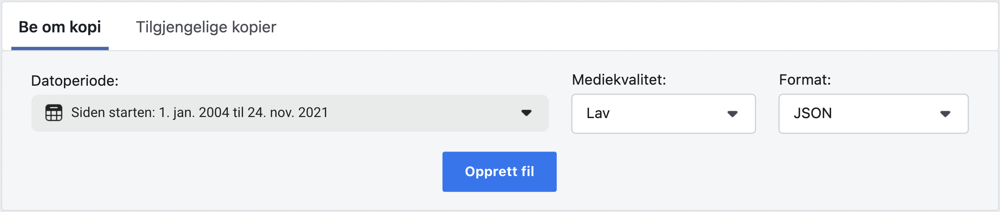
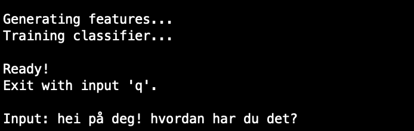

## Messenger-prosjekter

### Klassifiserer
#### Avhengigheter
##### NLTK
`pip install nltk`
##### NLTK-data
Manglende datapakker vises ved kjøring.
[Offisiell veilednig](https://www.nltk.org/data.html)

#### Hvordan legge til Messenger-data
##### Last ned din Facebook-informasjon
`Innstillinger og personvern > Innstillinger > Din Facebook-infomrasjon > Last ned informasjonen din`

Velg datoperiode "Siden starten" for å sikre mest mulig data, mediekvalitet "lav", format "JSON" og "Opprett fil".
Datapakken kan lastes ned under fanen "Tilgjengelige kopier" når den er klar.
##### Flytt meldingsdata inn i prosjektet
Flytt mappen `inbox` som ligger i kopien du lastet ned, inn i rotmappen til dette prosjektet.

#### Hvordan kjøre
`python classifier.py`

Hver mappe i `inbox`representerer en samtale i Messenger. Kopier mappenavnet til ønsket samtale og lim inn i programmet ved forspørsel.

Trekkgenerering kan ta litt tid avhengig av samtalens lengde.

